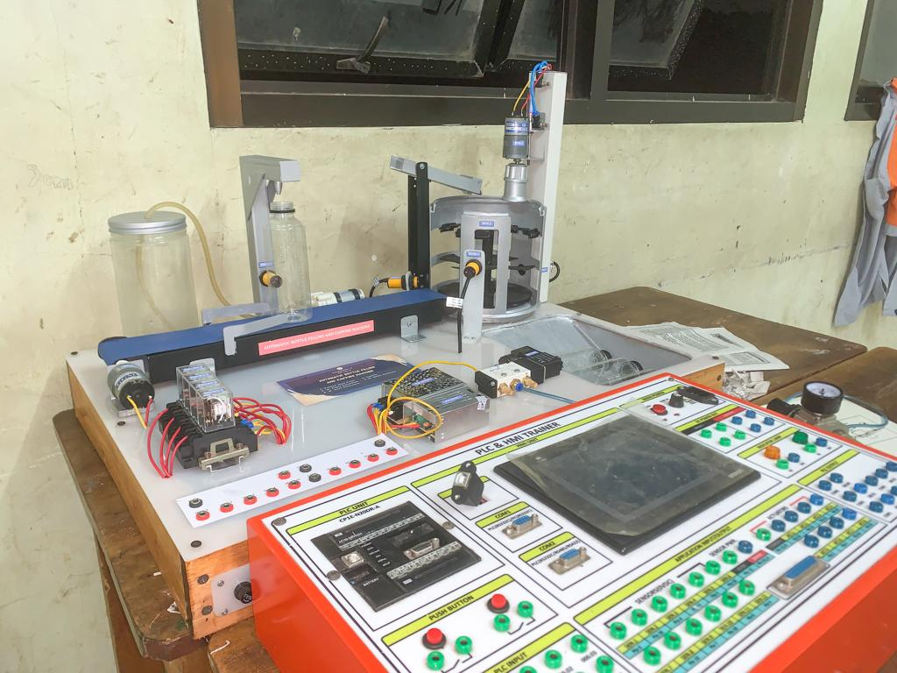
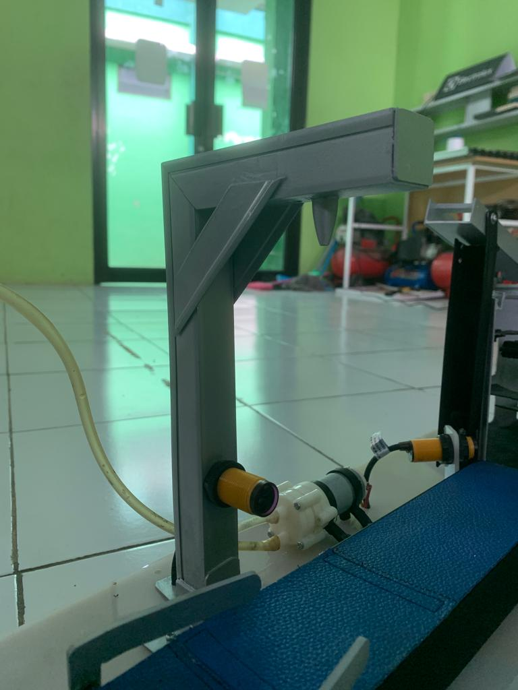
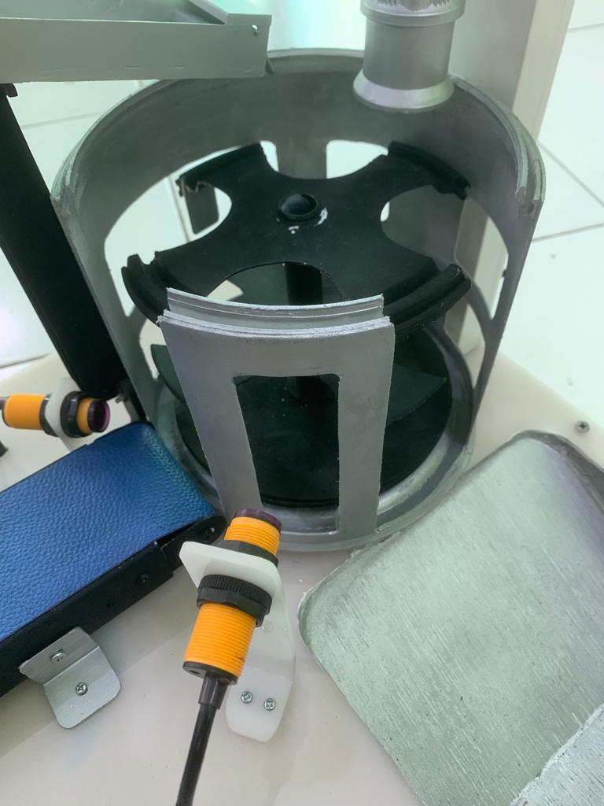
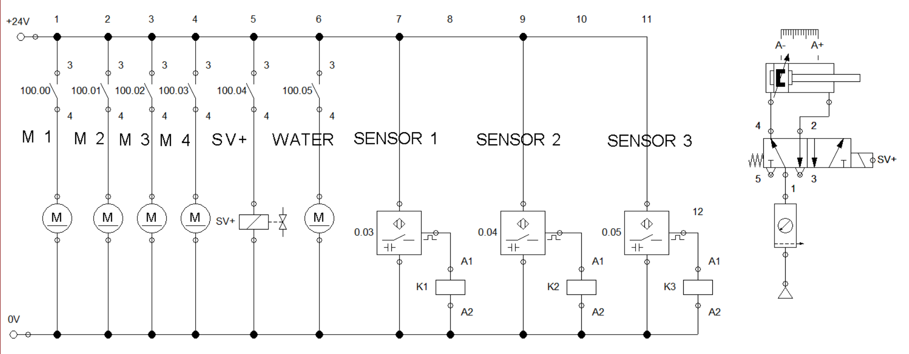

# 🏭 Automatic Bottle Filling and Capping Machine

A miniature PLC-based automatic bottle filling and capping system built using Omron CP1E, simulating a real industrial production line sequence with sensor-driven automation logic.

---

## 🔍 Overview

This project implements a fully automated bottle filling and capping process on a miniature conveyor system. The system uses an Omron CP1E PLC programmed with ladder diagram logic to control the sequential operation of a conveyor belt, water filling pump, and bottle capper actuator — triggered by proximity and photoelectric sensors at each station.

The project reflects core industrial automation principles used in FMCG and manufacturing production lines.

---

## ⚙️ System Architecture

```
[Bottle Input]
      ↓
[Conveyor Belt — DC Motor]
      ↓
[Photoelectric Sensor — Bottle Detection at Fill Station]
      ↓
[Filling Station — Water Pump Actuator]
      ↓
[Conveyor Belt — Move to Cap Station]
      ↓
[Proximity Sensor — Bottle Detection at Cap Station]
      ↓
[Capping Station — Press Actuator]
      ↓
[Output — Finished Bottle]
      ↓
[Omron CP1E PLC — Ladder Diagram Logic (CX-Programmer)]
```

---

## 🛠️ Hardware Components

| Component | Function |
|---|---|
| Omron CP1E PLC | Main controller — sequential logic execution |
| CX-Programmer | PLC programming software (Ladder Diagram) |
| Conveyor Belt (DC Motor) | Transports bottles between stations |
| Water Filling Pump | Fills bottle at filling station |
| Capper Actuator | Presses cap onto bottle at capping station |
| Photoelectric Sensor | Detects bottle presence at filling station |
| Proximity Sensor | Detects bottle presence at capping station |
| Schematic (FluidSIM) | Electrical wiring & integration |

---

## 💻 Software & Tools

| Tool | Usage |
|---|---|
| CX-Programmer | Ladder diagram programming for Omron CP1E |
| FluidSIM | Electrical schematic design |

---

## 🔧 Features

- **Fully automated sequential control** — conveyor, filling, and capping in one continuous cycle
- **Sensor-driven triggering** — photoelectric and proximity sensors for precise station detection
- **Ladder diagram logic** — programmed using standard industrial PLC methodology
- **Timed filling control** — pump activated for a set duration per bottle
- **Capping press sequence** — actuator engages and retracts automatically after detection
- **Continuous cycle operation** — system loops automatically for uninterrupted production

---

## 🔄 Sequence of Operation

1. Conveyor starts — bottle moves from input toward filling station
2. Photoelectric sensor detects bottle → conveyor stops
3. Filling pump activates for set duration → pump stops
4. Conveyor resumes → bottle moves toward capping station
5. Proximity sensor detects bottle → conveyor stops
6. Capping actuator presses down → retracts after set duration
7. Conveyor resumes → finished bottle exits to output
8. Cycle repeats automatically

---

## 📁 Repository Structure

```
automatic-bottle-filling/
├── ladder-diagram/
│   └── bottle_filling.cxp     # CX-Programmer project file
├── schematic/
│   └── schematic.png          # Electrical schematic (FluidSIM)
├── docs/
│   └── images/                # System photos & videos
└── README.md
```

---

## 📸 Documentation

> Add system photos to `/docs/images/` and update links below.

| System Overview | Filling Station | Capping Station | Schematic |
|---|---|---|---|
|  |  |  |  |

---

## 🚀 How to Run

1. **Open ladder diagram**
   - Open `ladder-diagram/bottle_filling.cxp` using CX-Programmer
   - Connect PC to Omron CP1E via USB

2. **Transfer program to PLC**
   - Go to **PLC → Transfer → To PLC**
   - Confirm transfer

3. **Run the system**
   - Set PLC to **RUN** mode
   - Place bottle at input position
   - System runs automatically

---

## 👤 Author

**Farhan Ibnufajar**
Electrical Engineering — Universitas Jenderal Soedirman (Unsoed)

Project Based Learning - Electronics Industry Engineering State Vocational School 2 Bekasi

[](https://github.com/farhanibnufajar)
[](https://farhanibnufajar.github.io)
